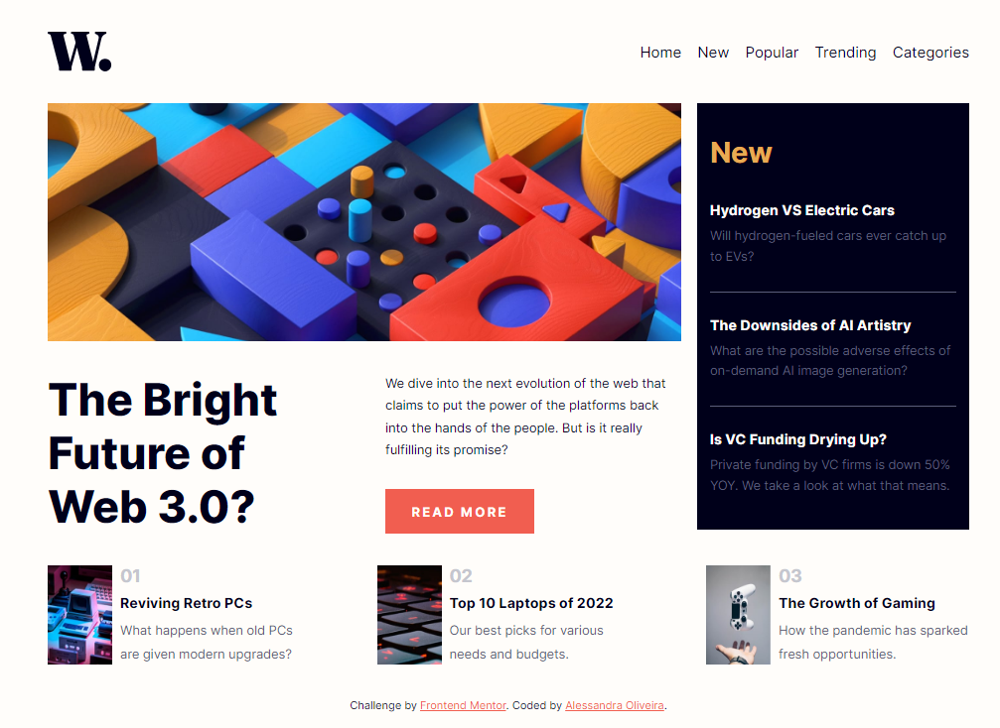
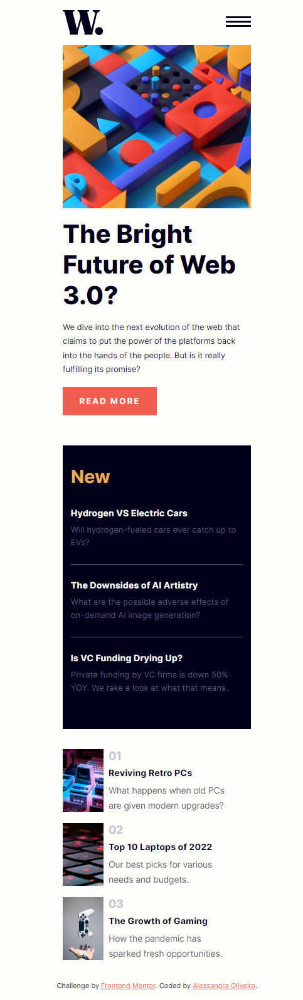
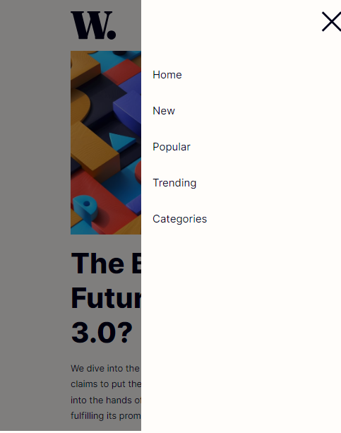

# Frontend Mentor - News Homepage Solution

This is a solution to the [News Homepage Challenge on Frontend Mentor](https://www.frontendmentor.io/challenges/news-homepage-H6SWTa1MFl). Frontend Mentor challenges help you improve your coding skills by building realistic projects. 

## Table of contents

- [Overview](#overview)
  - [The challenge](#the-challenge)
  - [Screenshot](#screenshot)
  - [Links](#links)
- [My process](#my-process)
  - [Built with](#built-with)
- [Author](#author)

## Overview

This is my solution to the news homepage challenge. It was built entirely with HTML, CSS and JavaScript

### The challenge

Users should be able to:

- View the optimal layout for the interface depending on their device's screen size
- See hover and focus states for all interactive elements on the page

### Screenshot

**Desktop solution:**

  

**Mobile solution:**

  
  

**Mobile solution (menu opened):**

  
  

### Links

- Solution URL: [My solution on Frontend Mentor](https://www.frontendmentor.io/solutions/news-homepage-solution-vfOnssoIY3)
- Live Site URL: [Live site with Github Pages](https://itsale-o.github.io/news-homepage/)

## My process

### Built with

- Semantic HTML5 markup
- CSS custom properties
- JavaScript

## Author

- LinkedIn - [Alessandra Oliveira](https://www.linkedin.com/in/alessandra-santos-oliveira/)
- Frontend Mentor - [@itsale-o](https://www.frontendmentor.io/profile/itsale-o)
- Twitter - [@itsale_o](https://www.twitter.com/itsale_o)

